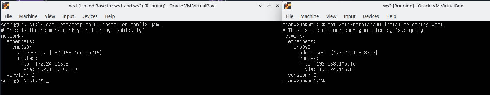
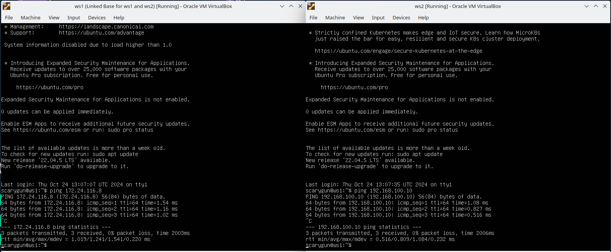
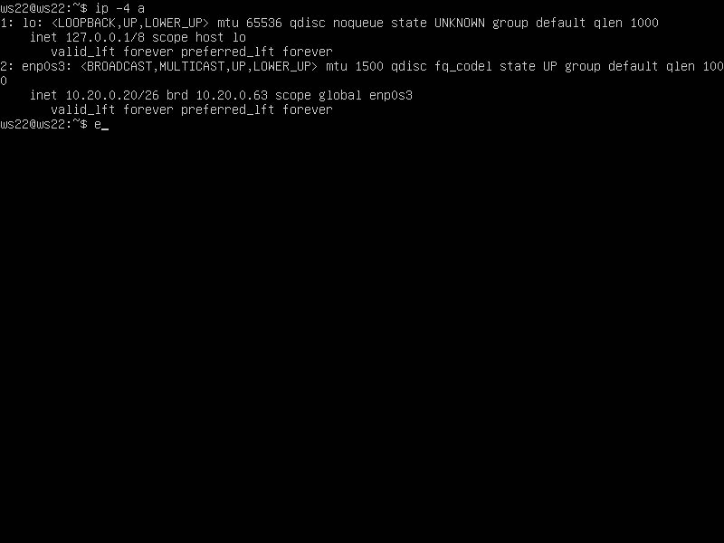
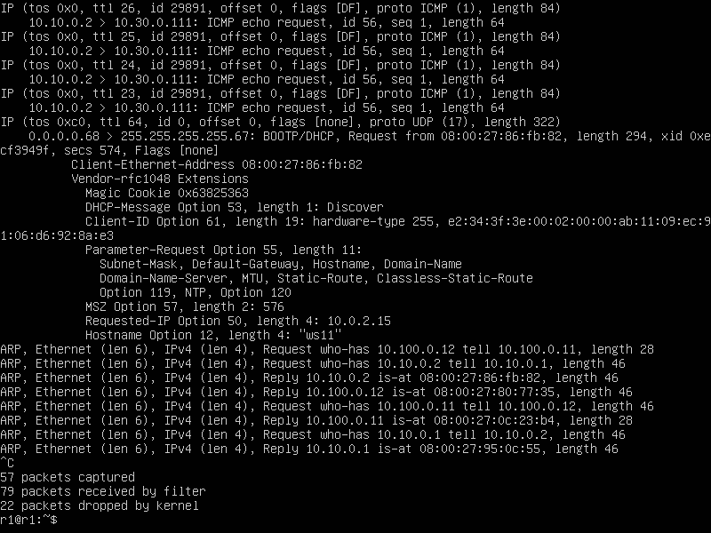
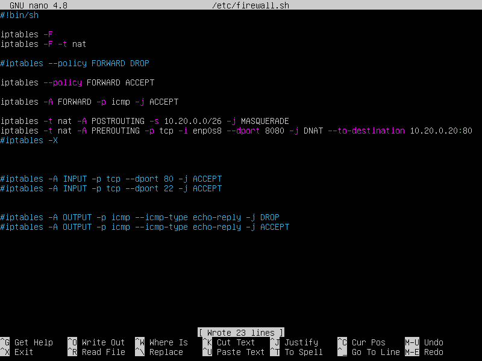

## Part 1. Инструмент ipcalc

#### 1.1. Сети и маски
 1) `Адрес сети *192.167.38.54* - *192.160.0.0*` 
 

      

 2) `Перевод маски *255.255.255.0* в префискную и двоичную запись`

	- CIDR: /24
	- Mask: 255.255.255.0
	- Binary mask: 11111111.11111111.11111111.00000000
    
    

    `Перевод маски */15* в обычную и двоичную запись`
    - CIDR: /15
    - Mask: 255.254.0.0
    - Binary mask: 11111111.11111110.00000000.00000000
    
    

    `Перевод маски *11111111.11111111.11111111.11110000* в обычную и двоичную запись`
	- CIDR: /28
	- Mask: 255.255.255.240
	- Binary mask: 11111111.11111111.11111111.11110000

    

 3) ` MIN host: *12.0.0.1* MAX host: *12.255.255.254*`

    

	` MIN host: *12.167.0.1* MAX host: *12.167.255.254*`

    

	` MIN host: *12.167.38.1* MAX host: *12.167.39.254*`

    

	` MIN host: *0.0.0.1* MAX host: *15.255.255.254*`

### loopback и localhost ( не 8080 )
Localhost адреса это 127.0.0.1 с маской 8 (255.0.0.0), т.е. все адреса, у которых первый октет это 127 - пренадлежат loopback интерфейсу

| Loopback (localhost)| Обычный адрес |
| -------- | ------- |
| 127.0.0.2 | 194.34.23.100 |
| 127.1.0.1 | 128.0.0.1 |

### Диапазоны и сегменты сетей
#### Публичные и частные сети
| Публичные | Частные |
| -------- | ------- |
| 192.172.0.1 | 10.0.0.45 |
| 172.68.0.2 | 172.20.250.4 |
| 192.169.168.1 | 172.0.2.1 |
|  | 192.168.4.2 |
|  | 172.16.255.255 |
|  | 10.10.10.10 |

Согласно RFC 1918 (Address Allocation for Private Internets), зарезервироваными частными (серыми) IP адресами являются сети:
| Минимальный адрес | Максимальный адрес | Маска | Кол-во адресов |
| -------- | ------- | ------- | ------- |
| 10.0.0.0 | 10.255.255.255 | 255.0.0.0 | 16777214 |
| 172.16.0.0 | 172.31.255.255 | 255.240.0.0 | 1048574 |
| 192.168.0.0 | 192.168.255.255 | 255.255.0.0 | 65534 |

#### Шлюзы сети 10.10.0.0/18
10.10.0.0/18, маска 18 = 11111111.11111111.11000000.00000000
| Адрес | Совпадение по маске | Входит |
| -------- | ------- | ------- |
| 10.0.0.1 | 11111111.~~11111111~~.11000000.00000000 | Нет |
| 10.10.0.2 | 11111111.11111111.11000000.00000000 | Да |
| 10.10.10.10 | 11111111.11111111.11000000.00000000 | Да |
| 10.10.100.1 | 11111111.11111111.11000000.00000000 | Да |
| 10.10.1.255 | 11111111.11111111.11000000.00000000 | Да |

## Part 2. Статическая маршрутизация между двумя машинами

Смотрим существующие сетевые интерфейсы с помощью команды `ip a`:

#### 2.1. Добавление статического маршрута вручную

Добавим статистический маршрут при помощи команды `ip r add` и пропингуем соединение между машинами:

#### 2.2. Добавление статического маршрута с сохранением

Добавим статический маршрут от одной машины до другой с помощью файла *etc/netplan/00-installer-config.yaml*, перезапустим сервер сети и пропингуем соединение между машинами:

## Part 3. Утилита iperf3

#### 3.1. Скорость соединения
##### Перевести и записать в отчёт: 8 Mbps в MB/s, 100 MB/s в Kbps, 1 Gbps в Mbps

- 8 Mbps = 1 MB/s
- 100 MB/s = 819200 Kbps
- 1 Gbps = 1024 Mbps

#### 3.2. Утилита **iperf3**
##### Измерить скорость соединения между ws1 и ws2

## Part 4. Сетевой экран

#### 4.1. Утилита **iptables**

	Правила выполняться сверху-вниз, следовательно, если правило запрета находиться выше оно срабатывает, а правило разрешения находящиеся ниже нет.

#### 4.2. Утилита **nmap**

    
    Видно, что хост второй машины запущен, но не пингуется.

## Part 5. Статическая маршрутизация сети

Сеть:

## Part 5. Статическая маршрутизация сети

##### Поднял пять виртуальных машин (3 рабочие станции (ws11, ws21, ws22) и 2 роутера (r1, r2)).

#### 5.1. Настройка адресов машин
##### Настроил конфигурации машин в *etc/netplan/00-installer-config.yaml* согласно сети на рисунке.
### r1:

### r2:

### ws11: 

### ws21: 

### ws22:

##### Перезапустил сервис сети.  Командой `ip -4 a` проверил, что адрес машины задан верно. Также пропинговал ws22 с ws21. Аналогично пропинговал r1 с ws11.
### ip -4 a r1:

### ip -4 a r2:

### ip -4 a ws11:

### ip -4 a ws21:

### ip -4 a ws22:

### ping с ws21 в ws22:

### ping с ws11 в r1:

#### 5.2. Включение переадресации IP-адресов
##### Для включения переадресации IP выполнил команду sysctl -w net.ipv4.ip_forward=1 на роутерах:

### forward r1:

### forward r2:

##### Открыл файл */etc/sysctl.conf* и добавил в него строку <net.ipv4.ip_forward = 1>:
### static forward r1:

### static forward r2:

#### 5.3. Установка маршрута по умолчанию
##### Настроил маршрут по умолчанию (шлюз) для рабочих станций. Для этого добавил `default` перед IP-роутера в файле конфигураций.
### Для r1:

### Для r2:

##### Вызовал `ip r` и показал, что добавился маршрут в таблицу маршрутизации.

##### Пропинговал с ws11 роутер r2 и показал на r2, что пинг доходит. Для этого использовал команду `tcpdump -tn -i enp0s08`:
### ping с ws11:

### tcpdump в r2:

#### 5.4. Добавление статических маршрутов
##### Добавил в роутеры r1 и r2 статические маршруты в файле конфигураций
### Для r1:

### Для r2:

##### Вызвал `ip r` и показал таблицы с маршрутами на обоих роутерах:
### Для r1:

### Для r2:

##### Запустил команды `ip r list 10.10.0.0/[маска сети]` и `ip r list 0.0.0.0/0` на ws11:

### Две выполненные команды:

#### 5.5. Построение списка маршрутизаторов
##### Запусти на r1 команду дампа `tcpdump -tnv -i enp0s8`:

##### При помощи утилиты **traceroute** построил список маршрутизаторов на пути от ws11 до ws21.

### После изучения команды traceroute я пришел к выводу , что она , выполняясь , показывает путь до заданного в параметрах ip , а путь в данном случае
### является списком маршрутизаторов с их ip 

#### 5.6. Использование протокола **ICMP** при маршрутизации
##### Запустил на r1 перехват сетевого трафика, проходящего через enp0s8 с помощью команды `tcpdump -n -i eth0 icmp`:

##### Пропинговал с ws11 несуществующий IP  *10.30.0.111* с помощью команды `ping -c 1 10.30.0.111`:

##### Сохранил дампы образов виртуальных машин и продублировал оные через облачное хранилище

## Part 6. Динамическая настройка IP с помощью **DHCP**

##### Для r2 настроил в файле */etc/dhcp/dhcpd.conf* конфигурацию службы **DHCP** и в файле *resolv.conf* прописал `nameserver 8.8.8.8`:

##### Перезагрузил службу **DHCP** командой `systemctl restart isc-dhcp-server`. Машину ws21 перезагрузил при помощи `reboot` и через `ip a` показал, что она получила адрес. Также пропинговал ws22 с ws21.

### Перезагрузка DHCP:

### Проверка изменения ip адреса до/после:
#### До:

#### После:

### Ping с ws21 ws22:

##### Указал MAC-адрес у ws11, для этого в *etc/netplan/00-installer-config.yaml* добавил строки: `macaddress: 10:10:10:10:10:BA`, `dhcp4: true`.

##### Для r1 настроил аналогично r2, но сделал выдачу адресов с жесткой привязкой к MAC-адресу (ws11). Провел аналогичные тесты:
### Конфигурация r1:

### Перезагрузил isc-dhcp-server через systemctl и сделал reboot на ws11 

##### Запросил с ws21 обновление IP-адреса через команду sudo dhclient (установка isc-dhcp-server не требуется) и сравнил выводы до жесткого присваивания ip по mac
##### и после :
### До:

### После:

##### Сохранил дампы образов виртуальных машин.

## Part 7. **NAT**

##### В файле */etc/apache2/ports.conf* на ws22 и r1 изменил строку `Listen 80` на `Listen 0.0.0.0:80`, сделал сервер Apache2 общедоступным.
### В r1:

### В ws22:

##### Запустил веб-сервер Apache командой `service apache2 start` на ws22 и r1.
### В r1:

#### В ws22

##### Добавил в фаервол, созданный по аналогии с фаерволом из Части 4, на r2 следующие правила:
##### 1) Удаление правил в таблице filter — `iptables -F`;
##### 2) Удаление правил в таблице «NAT» — `iptables -F -t nat`;
##### 3) Отбрасывать все маршрутизируемые пакеты — `iptables --policy FORWARD DROP`.

##### Запустил файл также, как в Части 4.

##### Проверил соединение между ws22 и r1 командой `ping` (его не должно быть из за отсутствия правил разрешающих принимать icmp - запросы в кои входит и ping).

##### Добавил в файл ещё одно правило:
##### 4) Разрешил маршрутизацию всех пакетов протокола **ICMP**.

##### Запустил файл также, как в Части 4.

##### Проверил соединение между ws22 и r1 командой `ping`.

##### Добавил в файл ещё два правила:
##### 5) Включение **SNAT**, а именно маскирование всех локальных IPиз локальной сети, находящейся за r2 (по обозначениям из Части 5 — сеть 10.20.0.0).
##### 6) Включение **DNAT** на 8080 порт машины r2 и добавить к веб-серверу Apache, запущенному на ws22, доступ извне сети.

##### Запустил файл также, как в Части 4.

##### Проверил соединение по TCP для **SNAT**: для этого с ws22 подключился к серверу Apache на r1 командой <telnet 10.10.0.1 80>:

##### Проверил соединение по TCP для **DNAT**: для этого с r1 подключился к серверу Apache на ws22 командой <telnet 10.100.0.12 8080> :

##### Сохранил дампы образов виртуальных машин.

## Part 8. Дополнительно. Знакомство с **SSH Tunnels**

##### Запустил на r2 фаервол с правилами из Части 7.

##### Запустил веб-сервер **Apache** на ws22 только на localhost (в файле */etc/apache2/ports.conf* изменил строку `Listen 80` на `Listen localhost:80`).

##### Воспользовался *Local TCP forwarding* с ws21 до ws22, чтобы получить доступ к веб-серверу на ws22 с ws21.

##### Воспользовался *Remote TCP forwarding* c ws11 до ws22, чтобы получить доступ к веб-серверу на ws22 с ws11.

##### Для проверки, сработало ли подключение в обоих предыдущих пунктах, перешел во второй терминал (с помощью клавиш Alt + F2) и выполнил команду `telnet 127.0.0.1 80`:
### Для ws21 в ws22:

### Для ws11 в ws22:

##### Дампы образов виртуальных машин не сохранял .